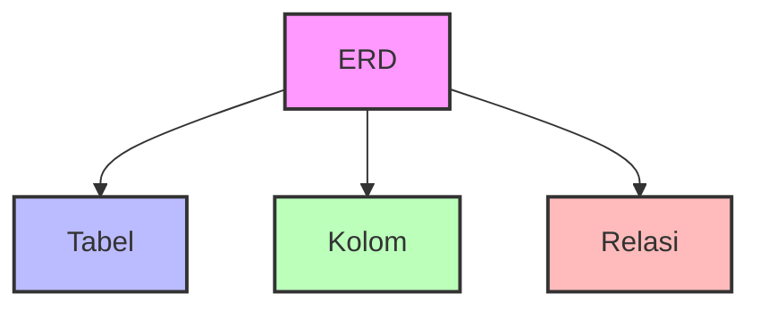

# MySQL
## Fundamental MySQL   
### Apakah itu MySQL?
MySQL adalah sistem manajemen basis data (database management system) yang sangat populer di dunia. MySQL menggunakan bahasa SQL (Structured Query Language) untuk mengelola data. MySQL bersifat open-source, artinya bisa digunakan secara gratis dan memiliki komunitas yang besar.

Beberapa keunggulan MySQL:

-   Mudah digunakan dan dipelajari
-   Cepat dan efisien
-   Bisa menangani data dalam jumlah besar
-   Banyak digunakan di berbagai aplikasi web
-   Mendukung berbagai sistem operasi (Windows, Linux, macOS)
        
    -   Instalasi dan konfigurasi dasar MySQL
        
    -   Tools untuk akses MySQL (seperti MySQL CLI, phpMyAdmin, atau MySQL Workbench)

### Tentang SQL

SQL (Structured Query Language) adalah bahasa pemrograman yang digunakan untuk mengelola dan memanipulasi data dalam database. 

SQL memungkinkan kita untuk:
- Membuat database dan tabel
- Menyimpan data
- Mengambil data
- Mengubah data
- Menghapus data

SQL menggunakan perintah-perintah yang mudah dipahami karena mirip dengan bahasa Inggris sehari-hari. Misalnya:
- `SELECT` untuk memilih data
- `INSERT` untuk menambah data
- `UPDATE` untuk mengubah data
- `DELETE` untuk menghapus data

# Perancangan Basis Data

Bayangkan merancang basis data seperti merancang sebuah toko. Sebelum membuka toko, kita perlu merencanakan:

-   Apa saja yang akan dijual (data apa yang akan disimpan)
-   Bagaimana mengatur barang-barang (struktur data)
-   Bagaimana pelanggan akan menemukan barang (cara mengakses data)

## Bagaimana Perancangan Basis Data Itu?

Perancangan basis data adalah proses merencanakan struktur database sebelum membuatnya. Ini seperti membuat denah rumah sebelum membangunnya. Prosesnya meliputi:

1.  **Analisis Kebutuhan**
    
    -   Apa data yang perlu disimpan?
    -   Siapa yang akan menggunakan data?
    -   Bagaimana data akan digunakan?
2.  **Perancangan Konseptual**
    
    -   Mengidentifikasi entitas (benda/objek)
    -   Menentukan hubungan antar entitas
    -   Membuat ERD (Entity Relationship Diagram)
3.  **Perancangan Logis**
    
    -   Mengubah ERD menjadi tabel-tabel
    -   Menentukan kolom-kolom dalam tabel
    -   Menentukan tipe data yang sesuai
4.  **Perancangan Fisik**
    
    -   Membuat database di MySQL
    -   Membuat tabel-tabel
    -   Menambahkan indeks untuk performa

## Penggunaan ERD dalam Perancangan Basis Data

### Apa itu ERD?

ERD (Entity Relationship Diagram) adalah gambar yang membantu kita merancang database. Bayangkan ERD seperti denah toko yang menunjukkan:

-   Di mana rak-rak berada (tabel)
-   Apa yang ada di setiap rak (kolom)
-   Bagaimana rak-rak terhubung (relasi)

### Komponen ERD

1.  **Entity (Tabel)**
    
    -   Seperti lemari penyimpanan data
    -   Contoh dalam kehidupan nyata:
        -   Tabel "Pelanggan" = Daftar pelanggan toko
        -   Tabel "Produk" = Katalog produk toko
2.  **Atribut (Kolom)**
    
    -   Informasi yang disimpan dalam tabel
    -   Contoh dalam tabel "Pelanggan":
        -   `nama`  = Nama pelanggan
        -   `no_telepon`  = Nomor telepon pelanggan
        -   `alamat`  = Alamat pelanggan
3.  **Hubungan**
    
    -   Menunjukkan bagaimana tabel-tabel saling terhubung
    -   Contoh:
        -   Satu pelanggan bisa membuat banyak pesanan
        -   Satu pesanan bisa berisi banyak produk

### Contoh ERD: Sistem Toko Online

### Penjelasan Contoh ERD

1.  **Tabel PELANGGAN**
    
    -   Menyimpan data pelanggan
    -   `id_pelanggan`  sebagai kunci utama (PK)
    -   Informasi dasar seperti nama, telepon, dan alamat
2.  **Tabel PESANAN**
    
    -   Mencatat pesanan dari pelanggan
    -   `id_pesanan`  sebagai kunci utama
    -   `id_pelanggan`  sebagai kunci asing (FK) ke tabel PELANGGAN
3.  **Tabel PRODUK**
    
    -   Menyimpan informasi produk
    -   `id_produk`  sebagai kunci utama
    -   Informasi produk seperti nama, harga, dan stok
4.  **Tabel ITEM_PESANAN**
    
    -   Menghubungkan pesanan dengan produk
    -   Mencatat berapa banyak produk yang dipesan
    -   Menghitung subtotal untuk setiap item

## Tips Merancang Database yang Baik

1.  **Mulai dari Kebutuhan**
    
    -   Tulis semua data yang perlu disimpan
    -   Identifikasi hubungan antar data
    -   Buat daftar pertanyaan yang perlu dijawab
2.  **Gunakan Nama yang Jelas**
    
    -   Nama tabel harus deskriptif
    -   Nama kolom harus mudah dipahami
    -   Konsisten dalam penamaan
3.  **Pertimbangkan Performa**
    
    -   Gunakan tipe data yang tepat
    -   Tambahkan indeks untuk pencarian cepat
    -   Hindari duplikasi data
4.  **Dokumentasikan**
    
    -   Buat catatan untuk setiap tabel
    -   Jelaskan hubungan antar tabel
    -   Update dokumentasi saat ada perubahan

Dengan memahami konsep perancangan database ini, Anda sudah siap untuk mulai merancang database Anda sendiri. Ingat, perancangan yang baik di awal akan memudahkan pengembangan di kemudian hari.        

## Dasar-Dasar SQL (Structured Query Language)
    
### **1. DDL (Data Definition Language)**

DDL digunakan untuk **mendefinisikan atau mengubah struktur database** seperti tabel, index, dan schema.

-   **`CREATE`**: Membuat objek baru di database (seperti tabel, view, index).
    
    -   Contoh:
        
        sql
        
        CopyEdit
        
        `CREATE  TABLE Mahasiswa (
            NIM INT  PRIMARY KEY,
            Nama VARCHAR(50),
            Jurusan VARCHAR(30)
        );` 
        
-   **`ALTER`**: Mengubah struktur objek yang sudah ada.
    
    -   Contoh:
        
        sql
        
        CopyEdit
        
        `ALTER  TABLE Mahasiswa ADD  COLUMN Alamat VARCHAR(100);` 
        
-   **`DROP`**: Menghapus objek dari database secara permanen.
    
    -   Contoh:
        
        sql
        
        CopyEdit
        
        `DROP  TABLE Mahasiswa;` 
        

----------

### **2. DML (Data Manipulation Language)**

DML digunakan untuk **mengelola data** di dalam tabel (menambah, mengambil, memperbarui, menghapus).

-   **`SELECT`**: Mengambil data dari tabel.
    
    -   Contoh:
        
        sql
        
        `SELECT Nama, Jurusan FROM Mahasiswa;` 
        
-   **`INSERT`**: Menambahkan data baru ke tabel.
    
    -   Contoh:
        
        sql
        
        
        `INSERT  INTO Mahasiswa (NIM, Nama, Jurusan) VALUES (12345, 'Budi', 'Informatika');` 
        
-   **`UPDATE`**: Memperbarui data yang sudah ada.
    
    -   Contoh:
        
        sql
        
        
        `UPDATE Mahasiswa SET Alamat =  'Jl. Merdeka No.10'  WHERE NIM =  12345;` 
        
-   **`DELETE`**: Menghapus data dari tabel.
    
    -   Contoh:
        
        sql
        
        
        `DELETE  FROM Mahasiswa WHERE NIM =  12345;` 
        

----------

### **3. DCL (Data Control Language)**

DCL digunakan untuk **mengontrol hak akses** ke data di dalam database.

-   **`GRANT`**: Memberikan hak akses kepada user.
    
    -   Contoh:
        
        sql
        
        
        `GRANT  SELECT, INSERT  ON Mahasiswa TO User_A;` 
        
-   **`REVOKE`**: Mencabut hak akses yang sudah diberikan.
    
    -   Contoh:
        
        sql
        
        
        `REVOKE  INSERT  ON Mahasiswa FROM User_A;` 
        

----------

### **4. TCL (Transaction Control Language)**

TCL digunakan untuk **mengelola transaksi** dalam database agar perubahan bisa disimpan permanen atau dibatalkan.

-   **`COMMIT`**: Menyimpan semua perubahan dalam transaksi.
    
    -   Contoh:
        sql
        
        `INSERT  INTO Mahasiswa (NIM, Nama, Jurusan) VALUES (67890, 'Ani', 'Sistem Informasi'); COMMIT;` 
        
-   **`ROLLBACK`**: Membatalkan perubahan dalam transaksi yang belum di-`COMMIT`.
    
    -   Contoh:
        
        sql
        
        `INSERT  INTO Mahasiswa (NIM, Nama, Jurusan) VALUES (67891, 'Susi', 'Teknik Elektro'); ROLLBACK;` 
        
    
    (Data yang di-insert akan dibatalkan dan tidak masuk ke tabel.)
        
-   **Membuat dan Mengelola Tabel**
    
  ### **1. Tipe Data di MySQL**

Tipe data digunakan untuk menentukan **jenis nilai** yang boleh disimpan di kolom tabel.

Beberapa tipe data umum:

-   **`INT`** (Integer): Untuk bilangan bulat.
    
    -   Contoh:
        
        sql
        
        CopyEdit
        
        `NIM INT` 
        
-   **`VARCHAR(n)`** (Variable Character): Untuk teks, dengan panjang maksimum `n` karakter.
    
    -   Contoh:
        
        sql
        
        CopyEdit
        
        `Nama VARCHAR(50)` 
        
-   **`DATE`**: Untuk menyimpan tanggal (`YYYY-MM-DD`).
    
    -   Contoh:
        
        sql
        
        CopyEdit
        
        `Tanggal_Lahir DATE` 
        
-   **`FLOAT` / `DOUBLE`**: Untuk angka desimal (bilangan pecahan).
    
    -   Contoh:
        
        sql
        
        CopyEdit
        
        `IPK FLOAT(3,2)` 
        
-   **`BOOLEAN`**: Untuk data benar/salah (`TRUE`/`FALSE`).
    
    -   Contoh:
        
        sql
        
        CopyEdit
        
        `Aktif BOOLEAN` 
        

**Contoh pemakaian tipe data dalam tabel:**

sql

CopyEdit

`CREATE  TABLE Mahasiswa (
    NIM INT,
    Nama VARCHAR(50),
    Tanggal_Lahir DATE,
    IPK FLOAT(3,2),
    Aktif BOOLEAN );` 

----------

### **2. Primary Key dan Foreign Key**

-   **Primary Key**: Kolom yang berfungsi sebagai **identitas unik** untuk setiap baris data.
    
    -   Tidak boleh `NULL`, harus **unik**.
        
    
    **Contoh Primary Key:**
    
    sql
    
    CopyEdit
    
    `CREATE  TABLE Mahasiswa (
        NIM INT  PRIMARY KEY,
        Nama VARCHAR(50)
    );` 
    
    (Setiap `NIM` harus unik dan wajib diisi.)
    
-   **Foreign Key**: Kolom yang **menghubungkan** satu tabel ke tabel lain.
    
    -   Digunakan untuk menjaga **integritas data** antar tabel.
        
    
    **Contoh Foreign Key:** Misal ada tabel `Jurusan`:
    
    sql
    
    CopyEdit
    
    `CREATE  TABLE Jurusan (
        KodeJurusan INT  PRIMARY KEY,
        NamaJurusan VARCHAR(50)
    );` 
    
    Lalu tabel `Mahasiswa` yang berhubungan dengan `Jurusan`:
    
    sql
    
    CopyEdit
    
    `CREATE  TABLE Mahasiswa (
        NIM INT  PRIMARY KEY,
        Nama VARCHAR(50),
        KodeJurusan INT, FOREIGN KEY (KodeJurusan) REFERENCES Jurusan(KodeJurusan)
    );` 
    
    (Setiap mahasiswa harus terdaftar di salah satu jurusan yang ada.)
    

----------

### **3. Indexing**

-   **Index** adalah struktur data yang digunakan untuk **mempercepat pencarian** data di dalam tabel.
    
-   Tanpa index, pencarian harus memeriksa satu per satu semua baris (**full table scan**), yang lambat kalau datanya banyak.
    

**Contoh membuat index:**

sql

CopyEdit

`CREATE INDEX idx_nama ON Mahasiswa(Nama);` 

(Sekarang pencarian berdasarkan `Nama` akan jauh lebih cepat.)

**Index otomatis dibuat** kalau kamu mendefinisikan kolom sebagai `PRIMARY KEY` atau `UNIQUE`.
        
-   **Operasi CRUD**
    
### **1. Membuat Data (Create Table & Insert Data)**

**a. Create Table**  
Digunakan untuk membuat struktur tabel baru.

Contoh membuat tabel `Mahasiswa`:

sql

CopyEdit

`CREATE  TABLE Mahasiswa (
    NIM INT  PRIMARY KEY,
    Nama VARCHAR(50),
    Jurusan VARCHAR(30),
    IPK FLOAT(3,2)
);` 

**b. Insert Data**  
Digunakan untuk menambahkan baris baru ke dalam tabel.

Contoh menambahkan data mahasiswa:

sql

CopyEdit

`INSERT  INTO Mahasiswa (NIM, Nama, Jurusan, IPK) VALUES (12345, 'Budi Santoso', 'Teknik Informatika', 3.75);` 

----------

### **2. Membaca Data (Read / Select)**

Mengambil dan menampilkan data dari tabel.

Contoh membaca seluruh data:

sql

CopyEdit

`SELECT  *  FROM Mahasiswa;` 

Contoh membaca kolom tertentu saja:

sql

CopyEdit

`SELECT Nama, IPK FROM Mahasiswa;` 

Contoh membaca data dengan kondisi:

sql

CopyEdit

`SELECT  *  FROM Mahasiswa WHERE IPK >  3.5;` 

----------

### **3. Memperbarui Data (Update)**

Mengubah data yang sudah ada di tabel.

Contoh memperbarui data:

sql

CopyEdit

`UPDATE Mahasiswa SET IPK =  3.85  WHERE NIM =  12345;` 

(Ini memperbarui IPK mahasiswa dengan NIM 12345.)

----------

### **4. Menghapus Data (Delete)**

Menghapus data dari tabel.

Contoh menghapus satu baris:

sql

CopyEdit

`DELETE  FROM Mahasiswa WHERE NIM =  12345;` 

Kalau mau **menghapus semua data** dalam tabel tapi tetap mempertahankan strukturnya:

sql

CopyEdit

`DELETE  FROM Mahasiswa;` 

(Atau pakai `TRUNCATE TABLE Mahasiswa;` untuk lebih cepat.)

----------

### 🔥 **Kesimpulan Cepat CRUD di SQL:**

Operasi

SQL Command

Contoh

**Create**

`CREATE TABLE`, `INSERT INTO`

Membuat tabel dan menambah data

**Read**

`SELECT`

Membaca data

**Update**

`UPDATE`

Memperbarui data

**Delete**

`DELETE`

Menghapus data
        
-   **Query Dasar**
    
### **1. Filtering Data dengan `WHERE`**

`WHERE` digunakan untuk **menyaring baris** yang memenuhi kondisi tertentu.

**Contoh:**

sql

CopyEdit

`SELECT  *  FROM Mahasiswa WHERE Jurusan =  'Teknik Informatika';` 

(Menampilkan semua mahasiswa yang jurusannya "Teknik Informatika".)

Bisa juga pakai kondisi lebih kompleks:

sql

CopyEdit

`SELECT  *  FROM Mahasiswa WHERE IPK >  3.5  AND Jurusan =  'Sistem Informasi';` 

(Hanya mahasiswa Sistem Informasi dengan IPK di atas 3.5.)

----------

### **2. Sorting dengan `ORDER BY`**

`ORDER BY` digunakan untuk **mengurutkan hasil query** berdasarkan satu atau lebih kolom.

**Contoh:**

sql

CopyEdit

`SELECT  *  FROM Mahasiswa ORDER  BY IPK DESC;` 

(Menampilkan data mahasiswa dari IPK tertinggi ke terendah.)

Bisa urutkan lebih dari satu kolom:

sql

CopyEdit

`SELECT  *  FROM Mahasiswa ORDER  BY Jurusan ASC, Nama ASC;` 

(Diurutkan berdasarkan Jurusan dulu, baru Nama.)

----------

### **3. Limitasi Hasil Query dengan `LIMIT`**

`LIMIT` digunakan untuk **membatasi jumlah hasil** yang ditampilkan.

**Contoh:**

sql

CopyEdit

`SELECT  *  FROM Mahasiswa ORDER  BY IPK DESC LIMIT 5;` 

(Menampilkan 5 mahasiswa dengan IPK tertinggi.)

Kalau mau skip beberapa baris (misal buat pagination):

sql

CopyEdit

`SELECT  *  FROM Mahasiswa ORDER  BY Nama
LIMIT 5  OFFSET  10;` 

(Melewati 10 baris pertama, lalu mengambil 5 baris berikutnya.)

----------

### **4. Menggunakan Wildcard (`LIKE`, `%`, `_`)**

Wildcard digunakan saat ingin **mencari data dengan pola tertentu** di kolom teks.

-   **`%`**: Mewakili **berapa pun** jumlah karakter (termasuk nol karakter).
    
-   **`_`**: Mewakili **satu karakter** tunggal.
    

**Contoh:**

Cari mahasiswa yang nama depannya "A":

sql

CopyEdit

`SELECT  *  FROM Mahasiswa WHERE Nama LIKE  'A%';` 

(Nama yang diawali huruf A, misalnya "Andi", "Agus".)

Cari mahasiswa yang nama belakangnya "i":

sql

CopyEdit

`SELECT  *  FROM Mahasiswa WHERE Nama LIKE  '%i';` 

(Nama yang berakhiran "i", misalnya "Budi", "Susi".)

Cari mahasiswa dengan nama 5 huruf, huruf ketiga adalah 'd':

sql

CopyEdit

`SELECT  *  FROM Mahasiswa WHERE Nama LIKE  '__d__';` 

(Contoh: "Adian", "Indra".)
        
-   **Fungsi-Fungsi SQL**
    
### **1. Fungsi Agregat**

Digunakan untuk **mengolah sekumpulan data** dan menghasilkan satu nilai ringkasan.

-   **`COUNT()`**: Menghitung jumlah baris.
    
    sql
    
    CopyEdit
    
    `SELECT  COUNT(*) FROM Mahasiswa;` 
    
    (Menghitung total mahasiswa.)
    
-   **`SUM()`**: Menjumlahkan nilai dari suatu kolom.
    
    sql
    
    CopyEdit
    
    `SELECT  SUM(IPK) FROM Mahasiswa;` 
    
    (Menjumlahkan semua IPK mahasiswa.)
    
-   **`AVG()`**: Menghitung rata-rata nilai kolom.
    
    sql
    
    CopyEdit
    
    `SELECT  AVG(IPK) FROM Mahasiswa;` 
    
    (Menghitung rata-rata IPK mahasiswa.)
    
-   **`MIN()`**: Mengambil nilai terkecil.
    
    sql
    
    CopyEdit
    
    `SELECT  MIN(IPK) FROM Mahasiswa;` 
    
    (IPK terkecil.)
    
-   **`MAX()`**: Mengambil nilai terbesar.
    
    sql
    
    CopyEdit
    
    `SELECT  MAX(IPK) FROM Mahasiswa;` 
    
    (IPK terbesar.)
    

----------

### **2. Fungsi String**

Digunakan untuk **memanipulasi teks atau karakter**.

-   **`CONCAT()`**: Menggabungkan beberapa string.
    
    sql
    
    CopyEdit
    
    `SELECT CONCAT(Nama, ' - ', Jurusan) AS Info FROM Mahasiswa;` 
    
    (Gabungkan Nama dan Jurusan.)
    
-   **`SUBSTRING()`**: Mengambil sebagian karakter dari string.
    
    sql
    
    CopyEdit
    
    `SELECT  SUBSTRING(Nama, 1, 3) AS Inisial FROM Mahasiswa;` 
    
    (Ambil 3 karakter pertama dari Nama.)
    
-   **`LOWER()`**: Mengubah teks menjadi huruf kecil semua.
    
    sql
    
    CopyEdit
    
    `SELECT  LOWER(Nama) FROM Mahasiswa;` 
    
    (Nama mahasiswa jadi huruf kecil.)
    
-   **`UPPER()`**: Mengubah teks menjadi huruf besar semua.
    
    sql
    
    CopyEdit
    
    `SELECT  UPPER(Nama) FROM Mahasiswa;` 
    
    (Nama mahasiswa jadi huruf besar.)
    

----------

### **3. Fungsi Tanggal dan Waktu**

Digunakan untuk **mengelola data bertipe tanggal dan waktu**.

-   **`NOW()`**: Menghasilkan **tanggal dan waktu** saat ini.
    
    sql
    
    CopyEdit
    
    `SELECT NOW();` 
    
    (Misalnya: `2025-04-26 14:30:00`)
    
-   **`CURDATE()`**: Menghasilkan **tanggal hari ini** tanpa waktu.
    
    sql
    
    CopyEdit
    
    `SELECT CURDATE();` 
    
    (Misalnya: `2025-04-26`)
    
-   **`DATEDIFF()`**: Menghitung **selisih hari** antara dua tanggal.
    
    sql
    
    CopyEdit
    
    `SELECT DATEDIFF('2025-05-01', '2025-04-26') AS SelisihHari;` 
    
    (Hasil: `5` hari.)
    

Kalau mau pakai di tabel, misalnya:

sql

CopyEdit

`SELECT Nama, DATEDIFF(CURDATE(), Tanggal_Lahir) AS UmurHari FROM Mahasiswa;` 

(Menghitung umur mahasiswa dalam hari.)

----------

### 🔥 **Ringkasan Cepat:**

**Agregat**

`COUNT`, `SUM`, `AVG`, `MIN`, `MAX`

`SELECT AVG(IPK) FROM Mahasiswa;`

**String**

`CONCAT`, `SUBSTRING`, `LOWER`, `UPPER`

`SELECT CONCAT(Nama, ' ', Jurusan) FROM Mahasiswa;`

**Tanggal/Waktu**

`NOW()`, `CURDATE()`, `DATEDIFF()`

`SELECT DATEDIFF(CURDATE(), Tanggal_Lahir) FROM Mahasiswa;`
        
-   **Join**
    
## 📚 **Konsep Relasi Antar Tabel**

-   Di database relasional, **data disimpan di beberapa tabel**.
    
-   Tabel-tabel itu **di-relasikan** dengan **primary key** di satu tabel dan **foreign key** di tabel lain.
    
-   JOIN digunakan untuk **menggabungkan data** dari beberapa tabel **berdasarkan hubungan antar kolom**.    

Contoh:  
Ada 2 tabel:

Mahasiswa

Jurusan

NIM (PK)

🡒

KodeJurusan (PK)

Nama

NamaJurusan

KodeJurusan (FK)

**Relasi:** `Mahasiswa.KodeJurusan` mengacu ke `Jurusan.KodeJurusan`.

----------

## 📎 **Macam-Macam JOIN**

----------

### 1. **INNER JOIN**

-   Mengembalikan **data yang cocok** di kedua tabel.
    
-   Kalau tidak ada kecocokan, data **tidak ditampilkan**.
    

**Contoh Query:**

sql

CopyEdit

`SELECT Mahasiswa.Nama, Jurusan.NamaJurusan FROM Mahasiswa INNER  JOIN Jurusan ON Mahasiswa.KodeJurusan = Jurusan.KodeJurusan;` 

----------

### 2. **LEFT JOIN (LEFT OUTER JOIN)**

-   Mengembalikan **semua data dari tabel kiri** (`Mahasiswa`), dan data dari tabel kanan (`Jurusan`) kalau ada yang cocok.
    
-   Kalau tidak ada pasangan, kolom dari tabel kanan akan `NULL`.
    

**Contoh Query:**

sql

CopyEdit

`SELECT Mahasiswa.Nama, Jurusan.NamaJurusan FROM Mahasiswa LEFT  JOIN Jurusan ON Mahasiswa.KodeJurusan = Jurusan.KodeJurusan;` 

----------

### 3. **RIGHT JOIN (RIGHT OUTER JOIN)**

-   Mengembalikan **semua data dari tabel kanan** (`Jurusan`), dan data dari tabel kiri (`Mahasiswa`) kalau ada yang cocok.
    
-   Kalau tidak ada pasangan, kolom dari tabel kiri akan `NULL`.
    

**Contoh Query:**

sql

CopyEdit

`SELECT Mahasiswa.Nama, Jurusan.NamaJurusan FROM Mahasiswa RIGHT  JOIN Jurusan ON Mahasiswa.KodeJurusan = Jurusan.KodeJurusan;` 

----------

### 4. **FULL JOIN (FULL OUTER JOIN)**

-   Mengembalikan **semua data dari kedua tabel**, cocok atau tidak cocok.
    
-   Jika tidak cocok, kolom dari tabel lain akan diisi `NULL`.
    

**Note:**  
Di MySQL **tidak langsung support `FULL JOIN`**, biasanya digantikan dengan:

sql

CopyEdit

`SELECT ... FROM Mahasiswa LEFT  JOIN Jurusan ON Mahasiswa.KodeJurusan = Jurusan.KodeJurusan UNION  SELECT ... FROM Mahasiswa RIGHT  JOIN Jurusan ON Mahasiswa.KodeJurusan = Jurusan.KodeJurusan;`  

----------
