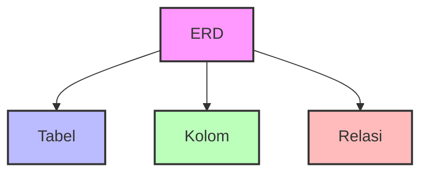
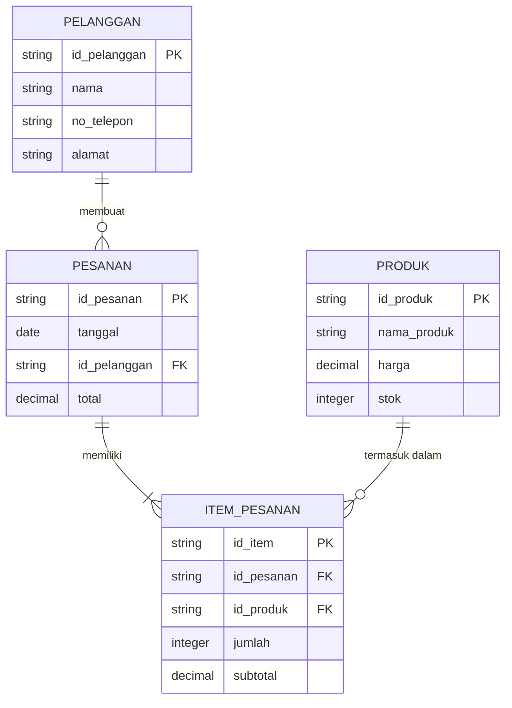

# Perancangan Basis Data

Bayangkan merancang basis data seperti merancang sebuah toko. Sebelum membuka toko, kita perlu merencanakan:
- Apa saja yang akan dijual (data apa yang akan disimpan)
- Bagaimana mengatur barang-barang (struktur data)
- Bagaimana pelanggan akan menemukan barang (cara mengakses data)

## Bagaimana Perancangan Basis Data Itu?

Perancangan basis data adalah proses merencanakan struktur database sebelum membuatnya. Ini seperti membuat denah rumah sebelum membangunnya. Prosesnya meliputi:

1. **Analisis Kebutuhan**
   - Apa data yang perlu disimpan?
   - Siapa yang akan menggunakan data?
   - Bagaimana data akan digunakan?

2. **Perancangan Konseptual**
   - Mengidentifikasi entitas (benda/objek)
   - Menentukan hubungan antar entitas
   - Membuat ERD (Entity Relationship Diagram)

3. **Perancangan Logis**
   - Mengubah ERD menjadi tabel-tabel
   - Menentukan kolom-kolom dalam tabel
   - Menentukan tipe data yang sesuai

4. **Perancangan Fisik**
   - Membuat database di MySQL
   - Membuat tabel-tabel
   - Menambahkan indeks untuk performa

## Penggunaan ERD dalam Perancangan Basis Data

### Apa itu ERD?

ERD (Entity Relationship Diagram) adalah gambar yang membantu kita merancang database. Bayangkan ERD seperti denah toko yang menunjukkan:
- Di mana rak-rak berada (tabel)
- Apa yang ada di setiap rak (kolom)
- Bagaimana rak-rak terhubung (relasi)

### Komponen ERD

1. **Entity (Tabel)** 
   - Seperti lemari penyimpanan data
   - Contoh dalam kehidupan nyata:
     - Tabel "Pelanggan" = Daftar pelanggan toko
     - Tabel "Produk" = Katalog produk toko

2. **Atribut (Kolom)**
   - Informasi yang disimpan dalam tabel
   - Contoh dalam tabel "Pelanggan":
     - `nama` = Nama pelanggan
     - `no_telepon` = Nomor telepon pelanggan
     - `alamat` = Alamat pelanggan

3. **Hubungan**
   - Menunjukkan bagaimana tabel-tabel saling terhubung
   - Contoh:
     - Satu pelanggan bisa membuat banyak pesanan
     - Satu pesanan bisa berisi banyak produk

### Contoh ERD: Sistem Toko Online

### Penjelasan Contoh ERD

1. **Tabel PELANGGAN**
   - Menyimpan data pelanggan
   - `id_pelanggan` sebagai kunci utama (PK)
   - Informasi dasar seperti nama, telepon, dan alamat

2. **Tabel PESANAN**
   - Mencatat pesanan dari pelanggan
   - `id_pesanan` sebagai kunci utama
   - `id_pelanggan` sebagai kunci asing (FK) ke tabel PELANGGAN

3. **Tabel PRODUK**
   - Menyimpan informasi produk
   - `id_produk` sebagai kunci utama
   - Informasi produk seperti nama, harga, dan stok

4. **Tabel ITEM_PESANAN**
   - Menghubungkan pesanan dengan produk
   - Mencatat berapa banyak produk yang dipesan
   - Menghitung subtotal untuk setiap item

## Tips Merancang Database yang Baik

1. **Mulai dari Kebutuhan**
   - Tulis semua data yang perlu disimpan
   - Identifikasi hubungan antar data
   - Buat daftar pertanyaan yang perlu dijawab

2. **Gunakan Nama yang Jelas**
   - Nama tabel harus deskriptif
   - Nama kolom harus mudah dipahami
   - Konsisten dalam penamaan

3. **Pertimbangkan Performa**
   - Gunakan tipe data yang tepat
   - Tambahkan indeks untuk pencarian cepat
   - Hindari duplikasi data

4. **Dokumentasikan**
   - Buat catatan untuk setiap tabel
   - Jelaskan hubungan antar tabel
   - Update dokumentasi saat ada perubahan

Dengan memahami konsep perancangan database ini, Anda sudah siap untuk mulai merancang database Anda sendiri. Ingat, perancangan yang baik di awal akan memudahkan pengembangan di kemudian hari.
